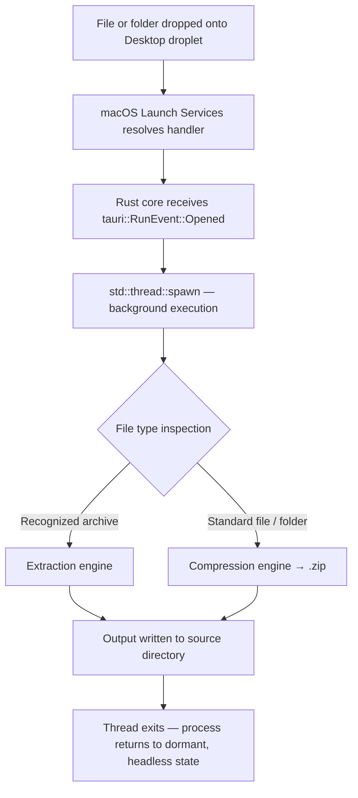

<div align="center">
  

  # CrunchCat

  **A headless, native macOS droplet that reduces file compression and extraction to a single OS-level gesture: drag, drop, done.**

  [](https://www.rust-lang.org/)
  [](https://tauri.app/)
  [](https://react.dev/)
  [](https://www.apple.com/macos/)
  [](LICENSE)
  [](https://doi.org/10.5281/zenodo.21842473)
</div>

---

## 🚀 Overview

Conventional archive utilities impose a fixed interaction cost regardless of task complexity: launch the application, wait for the window, navigate a file picker, select an operation. For the overwhelming majority of archive operations, this cost is disproportionate to the task itself.

CrunchCat removes the interaction entirely. It revives the **droplet** pattern and reimplements it as a compiled, natively distributed Rust and Tauri application highly optimized for Apple Silicon architectures. Rather than exposing a UI to drop files *into*, CrunchCat registers itself with macOS Launch Services as a generic document handler and resides on the Desktop as an inert icon. The operating system delivers the file; the application decides, in the background and without supervision, what to do with it.

## ✨ Key Features

- **Automatic Dual-Mode Dispatch:** A single drop target infers intent from the dropped item itself: recognized archives are extracted, all other files or folders are compressed. No mode selection, no dialogs.
- **Fully Headless Steady-State Operation:** Beyond a one-time setup, CrunchCat presents no window, no dock-based interaction, and no progress UI. The file-system side effect *is* the interface.
- **OS-Registered Drop Target:** File delivery is handled by Finder and Launch Services, not JavaScript drag-and-drop listeners. CrunchCat does not need to be running, frontmost, or loaded into memory prior to a drop.
- **Non-Blocking Native Concurrency:** Every archive operation executes on a dedicated OS thread (`std::thread::spawn`), isolated from Tauri's main event loop, ensuring zero IPC bottleneck regardless of payload size.
- **Ephemeral Setup Interface:** A transparent, frameless, premium dark-mode interface exists exclusively to establish the Desktop droplet on the first run, and self-terminates immediately after.

## 🧠 Architecture & Engineering

CrunchCat's architecture inverts the conventional relationship between a Tauri application's native core and its web-based frontend. CrunchCat treats the **Rust core as the application** and the **React/TypeScript frontend as a transient, dispensable setup surface**.



### True Native macOS Droplet Registration
CrunchCat is not an application with a drag-and-drop zone rendered inside a window. By injecting `CFBundleDocumentTypes` declarations into the bundle's `Info.plist`, macOS's **Launch Services** database reads this manifest and permits Finder to treat the compiled `.app` as a valid target for arbitrary file drops. The drop target is the Desktop `.app` alias itself; the delivery mechanism is the OS's native document-opening pipeline.

### Asynchronous Dual-Engine Processing in Rust
A drop delivered by Finder is surfaced to the Rust runtime as a `tauri::RunEvent::Opened` event. On receipt, the core inspects the path and dispatches to either the **compression engine** or the **extraction engine**. This work executes inside a dedicated background thread. Offloading to a background thread guarantees the application remains responsive to subsequent OS events.

### Ephemeral & Headless UI Lifecycle
On first launch, Tauri renders a transparent, frameless window. Its only function is to obtain explicit approval for creating the Desktop droplet alias. Upon approval, the frontend issues a single `invoke()` call to trigger the alias's creation, then immediately requests its own OS-level destruction:

```rust
app.get_webview_window("main").unwrap().hide().unwrap();
```

Once hidden, CrunchCat presents no window and executes no further frontend code—it exists as a dormant, OS-registered handler.

## 🛠 Installation & Build

### Prerequisites
- macOS (Apple Silicon or Intel)
- Node.js & npm
- Rust (`cargo`)

### Build Steps

```bash
# Clone the repository
git clone [https://github.com/iemirakman/CrunchCat.git](https://github.com/iemirakman/CrunchCat.git)
cd CrunchCat

# Install frontend dependencies
npm install

# Compile the optimized, production release bundle
npm run tauri build
```

On completion, the distributable `.dmg` installer and `.app` bundle will be written to:
`src-tauri/target/release/bundle/dmg/`

## 📦 Usage Workflow

1. **First-Run Setup:** Launch `CrunchCat.app`. A transparent setup window appears. Confirm the prompt to authorize the creation of the CrunchCat droplet alias on the Desktop.
2. **Auto-Termination:** On confirmation, the window is destroyed.
3. **Steady-State Workflow:** Drag any file, folder, or archive onto the CrunchCat Desktop icon. It silently determines the correct operation and executes it in the background.

## 📄 License

CrunchCat is distributed under the MIT License. See `LICENSE` for full terms.
