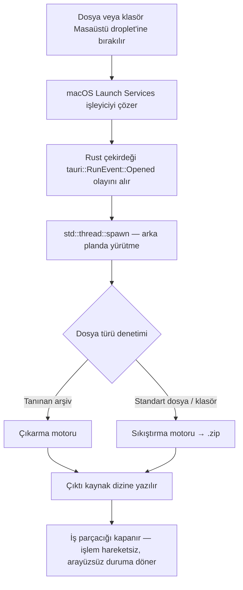

<div align="center">
  

  # CrunchCat

  **Dosya sıkıştırma ve çıkarma işlemlerini işletim sistemi düzeyinde tek bir harekete (sürükle, bırak, bitti) indirgeyen; arayüzsüz (headless), yerel bir macOS droplet'i.**

  [](https://github.com/iemirakman/CrunchCat/actions/workflows/rust.yml)
  [](https://www.rust-lang.org/)
  [](https://tauri.app/)
  [](https://react.dev/)
  [](https://www.apple.com/macos/)
  [](LICENSE)
  [](https://doi.org/10.5281/zenodo.21842473)
  <br><br>
  [](https://github.com/iemirakman/CrunchCat/releases/latest)
</div>

---

🌍 *Bu dokümantasyonu farklı bir dilde okuyun: [English](README.md), [Türkçe](README.tr.md).*

---

## 🚀 Genel Bakış

Geleneksel arşivleme araçları, görevin karmaşıklığından bağımsız olarak sabit bir etkileşim maliyeti dayatır: uygulamayı başlat, pencereyi bekle, dosya seçicide gezin, bir işlem seç. Arşiv işlemlerinin ezici çoğunluğu için bu maliyet, görevin kendisiyle orantısızdır.

CrunchCat bu etkileşimi tamamen ortadan kaldırır. **Droplet** modelini yeniden canlandırır ve Apple Silicon mimarileri için yüksek oranda optimize edilmiş; derlenmiş, yerel olarak dağıtılan bir Rust ve Tauri uygulaması olarak yeniden uygular. İçine dosya bırakılacak bir arayüz (UI) sunmak yerine CrunchCat, kendisini macOS Launch Services'e genel bir belge işleyicisi olarak kaydeder ve Masaüstünde hareketsiz bir simge olarak durur. İşletim sistemi dosyayı teslim eder; uygulama arka planda ve gözetimsiz olarak dosyayla ne yapacağına kendisi karar verir.

## ✨ Temel Özellikler

- **Otomatik Çift Modlu Yönlendirme:** Tek bir bırakma hedefi, amacı doğrudan bırakılan öğeden çıkarır: tanınan arşivler klasöre çıkarılır, diğer tüm dosya veya klasörler sıkıştırılır. Mod seçimi veya iletişim kutusu yoktur.
- **Tamamen Arayüzsüz (Headless) Kararlı Çalışma:** Tek seferlik kurulumun ötesinde CrunchCat; hiçbir pencere, Dock tabanlı etkileşim veya ilerleme arayüzü sunmaz. Dosya sistemindeki yan etki, arayüzün ta kendisidir.
- **İşletim Sistemine Kayıtlı Bırakma Hedefi:** Dosya teslimi, JavaScript sürükle-bırak dinleyicileri tarafından değil, doğrudan Finder ve Launch Services tarafından gerçekleştirilir. CrunchCat'in bir dosya bırakılmadan önce çalışıyor, en önde veya belleğe yüklenmiş olması gerekmez.
- **Bloke Etmeyen Yerel Eşzamanlılık (Concurrency):** Her arşiv işlemi, Tauri'nin ana olay döngüsünden izole edilmiş, işletim sistemine ait özel bir iş parçacığında (`std::thread::spawn`) yürütülür ve veri boyutu ne olursa olsun sıfır IPC darboğazı sağlar.
- **Geçici Kurulum Arayüzü:** Şeffaf, çerçevesiz, premium karanlık mod arayüzü, yalnızca ilk çalıştırmada Masaüstü droplet'ini oluşturmak için var olur ve hemen ardından kendi kendini sonlandırır.

## 🧠 Mimari ve Mühendislik

CrunchCat'in mimarisi, bir Tauri uygulamasının yerel çekirdeği ile web tabanlı önyüzü (frontend) arasındaki geleneksel ilişkiyi tersine çevirir. CrunchCat, **Rust çekirdeğini uygulamanın kendisi**, **React/TypeScript önyüzünü ise geçici, vazgeçilebilir bir kurulum yüzeyi** olarak ele alır.



### Gerçek Yerel macOS Droplet Kaydı
CrunchCat, bir pencere içinde işlenen bir sürükle-bırak alanına sahip sıradan bir uygulama değildir. Paketin `Info.plist` dosyasına `CFBundleDocumentTypes` bildirimleri enjekte edilerek, macOS'in **Launch Services** veritabanı bu manifestoyu okur ve Finder'ın derlenmiş `.app` dosyasını rastgele dosya bırakmaları için geçerli bir hedef olarak görmesine izin verir. Bırakma hedefi Masaüstündeki `.app` kısayolunun kendisidir; teslim mekanizması ise işletim sisteminin yerel belge açma ardışık düzenidir (pipeline).

### Rust'ta Asenkron Çift Motorlu İşleme
Finder tarafından teslim edilen bir dosya bırakma işlemi, Rust çalışma zamanına bir `tauri::RunEvent::Opened` olayı olarak yansıtılır. Alındığında, çekirdek dosya yolunu (path) inceler ve **sıkıştırma motoruna** veya **çıkarma motoruna** yönlendirir. Bu iş, ayrılmış bir arka plan iş parçacığında (thread) yürütülür. İşlemin bir arka plan iş parçacığına devredilmesi, uygulamanın sonraki işletim sistemi olaylarına karşı duyarlı (responsive) kalmasını garanti eder.

### Geçici ve Arayüzsüz (Headless) UI Yaşam Döngüsü
İlk çalıştırmada Tauri şeffaf, çerçevesiz bir pencere oluşturur. Bunun tek işlevi, Masaüstü droplet kısayolunu oluşturmak için açık onay almaktır. Onay üzerine önyüz (frontend), kısayolun oluşturulmasını tetiklemek için tek bir `invoke()` çağrısı yapar ve ardından hemen kendi işletim sistemi düzeyinde imha edilmesini ister:

```rust
app.get_webview_window("main").unwrap().hide().unwrap();
```

Gizlendikten sonra CrunchCat hiçbir pencere sunmaz ve başka hiçbir önyüz kodu çalıştırmaz—işletim sistemine kayıtlı, hareketsiz bir işleyici olarak varlığını sürdürür.

## 🛠 Kurulum ve Derleme

### Ön Koşullar
- macOS (Apple Silicon veya Intel)
- Node.js ve npm
- Rust (`cargo`)

### Derleme Adımları

```bash
# Depoyu klonlayın
git clone https://github.com/iemirakman/CrunchCat.git
cd CrunchCat

# Frontend bağımlılıklarını yükleyin
npm install

# Optimize edilmiş, üretime hazır (production) sürüm paketini derleyin
npm run tauri build
```

Tamamlandığında, dağıtılabilir `.dmg` yükleyicisi ve `.app` paketi şu yola yazılacaktır:
`src-tauri/target/release/bundle/dmg/`

## 📦 Kullanım İş Akışı

1. **İlk Çalıştırma Kurulumu:** `CrunchCat.app` dosyasını başlatın. Şeffaf bir kurulum penceresi görünür. Masaüstünde CrunchCat droplet kısayolunun oluşturulmasına yetki vermek için uyarıyı onaylayın.
2. **Otomatik Sonlanma:** Onaylandığında, pencere yok edilir.
3. **Kararlı Durum İş Akışı:** Herhangi bir dosyayı, klasörü veya arşivi Masaüstündeki CrunchCat simgesinin üzerine sürükleyin. Doğru işlemi sessizce belirler ve arka planda yürütür.

## 📄 Lisans

CrunchCat, MIT Lisansı altında dağıtılmaktadır. Tam şartlar için `LICENSE` dosyasına bakın.